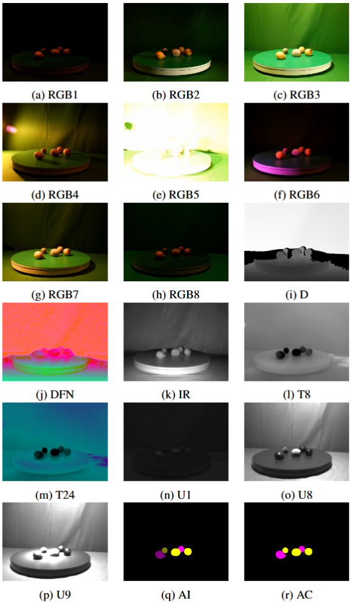

# MM5 Multimodal Dataset

## Overview
The MM5 dataset is a comprehensive multimodal dataset capturing RGB, Depth, Thermal (LWIR), Ultraviolet (UV), and Near-Infrared (NIR) images. It is designed for advanced multimodal research, providing diverse modalities, annotated data, and carefully calibrated and aligned images.

## Version
Make sure you download the latest version.
- 2025-04-23 - Initial version.
- 2025-06-23 - Updated:  
  - Added IAIP (Geometrically aligned intensity data created by using inpainted depth data – can include distortions)
  - Fixed labels (removed underrepresented "sliced" classes)
  - Fixed missing image issue in some processed data.
- 2025-08-03 - Updated:
  - Added RAW IAIP (Geometrically aligned intensity data created by using inpainted depth data – can include distortions)
  - Corrected class ID assignment to UV and thermal labels - now all IDs are aligned with the aligned dataset.

## Download Links
figshare: [https://doi.org/10.6084/m9.figshare.28722164](https://doi.org/10.6084/m9.figshare.28722164)

- [Download Link for Raw Data (incl. raw annotations)](https://figshare.com/ndownloader/files/56868443)
- [Download Link for Aligned/Cropped Data(incl. aligned annotations)](https://figshare.com/ndownloader/files/55555457)
- [Download Link for Label Studio annotations (JSON & COCO exports)](https://figshare.com/ndownloader/files/55555424)
- [Download Link for MM5 Calibration Images](https://figshare.com/ndownloader/files/55555421)

## Usage and Citation
If you use this dataset, please cite our publication and the dataset:
```
Brenner, Martin; Reyes, Napoleon; Susnjak, Teo; Barczak, Andre (2025). MM5: Multimodal Image Dataset. figshare. Dataset. https://doi.org/10.6084/m9.figshare.28722164
```
```
@article{BRENNER2026103516,
title = {MM5: Multimodal image capture and dataset generation for RGB, depth, thermal, UV, and NIR},
journal = {Information Fusion},
volume = {126},
pages = {103516},
year = {2026},
issn = {1566-2535},
doi = {https://doi.org/10.1016/j.inffus.2025.103516},
url = {https://www.sciencedirect.com/science/article/pii/S1566253525005883},
author = {Martin Brenner and Napoleon H. Reyes and Teo Susnjak and Andre L.C. Barczak},
keywords = {Multimodal dataset, Thermal imaging, UV imaging, Preprocessing, Sensor fusion, Dataset annotation}
}
```

If you use GatedFusion-Net, please cite this publication:
```
Brenner, Martin and Reyes, Napoleon H. and Susnjak, Teo and Barczak, Andre L. C., GatedFusion-Net: Per-Pixel Modality Selection in a Five-Cue Transformer for RGB-D-I-T-UV Fusion (June 08, 2025). Available at SSRN: https://ssrn.com/abstract=5379135 or http://dx.doi.org/10.2139/ssrn.5379135
```
## Publication
[MM5: Multimodal Image Capture and Dataset Generation for RGB, Depth, Thermal, UV, and NIR](https://doi.org/10.1016/j.inffus.2025.103516)

[GatedFusion-Net: Per-Pixel Modality Selection in a Five-Cue Transformer for RGB-D-I-T-UV Fusion](https://dx.doi.org/10.2139/ssrn.5379135)
## License
This dataset is available under [Creative Commons Attribution-NonCommercial 4.0](https://creativecommons.org/licenses/by/4.0/).
  
## Dataset Contents

The dataset consists of:
- RGB images captured under various lighting conditions.
- Raw and processed depth data (16-bit).
- Thermal images (16-bit raw, 24-bit static-colour encoded, and 8-bit dynamic range).
- Ultraviolet images.
- Near-infrared images (16-bit raw).
- Pixel-wise annotations for segmentation, instance segmentation, and classification both, for the aligned/cropped data as well as for the raw data.



## Dataset Structure

### Raw Data

The raw data is organised into separate folders corresponding to each camera modality. In our stereo setup, images from the left and right cameras are distinguished with suffixes `_0` and `_1`, respectively. Each file follows a standardised naming convention including:

```
[sequence_number]_[settings_ID]_[timestamp]_[modality].png
```

**Example:** `1_5_20240716_130310_143_rgb.png`

**Raw Data Folder Structure:**
- `DEPTH_0`, `DEPTH_1`
- `IR_0`, `IR_1`
- `LWIR`
- `META`
- `RGB_0`, `RGB_1`
- `UV`
- `ANNO_V`, `ANNO_T`, `ANNO_U`

### Data Types and Representations

- **Depth and IR:** Stored as 16-bit single-channel images. Available in two forms:
  - Raw (`_raw`)
  - Kinect SDK transformed (`_tr`)

- **Thermal (LWIR):** Available representations include:
  - Raw 16-bit images (`_lwir16`)
  - 24-bit fixed colour encoded images (`_lwir`)
  - 8-bit grayscale with automatic gain control (AGC) (`_lwir8dyn`)

Encoded LWIR images are provided for convenience and can be reproduced from raw data.

### Processed Data

Aligned and cropped data have sequential filenames (starting from 1) ensuring cross-modal consistency. All modalities corresponding to a single capture share identical filenames.

**Processed Data Folder Structure:**
- Annotations:
  - `ANNO_CLASS`, `ANNO_INST`
  - `ANNO_VIS_CLASS`, `ANNO_VIS_INST` (colour-coded for visualisation)

- Modalities:
  - Depth: `D`, `D_Focus`, `D_FocusN`, `D_Focus960N`, `D16`
  - Infrared: `I`, `I16`, `IAIP`
  - Metadata: `META`
  - RGB (lighting settings): `RGB1` – `RGB8`
  - Thermal: `T8`, `T16`, `T24`
  - Ultraviolet: `U1`, `U8`, `U9`

RGB and UV folder names correspond to their illumination settings, while Depth, IR, and Thermal folders indicate data encoding type.

## Directory Structure

### Raw Data
```
MM5_RAW/
├── DEPTH_0/
├── DEPTH_1/
├── IR_0/
├── IR_1/
├── LWIR/
├── META/
├── RGB_0/
├── RGB_1/
└── UV/
```

### Processed and Aligned Data
```
MM5_ALIGNED/
├── ANNO_CLASS/
├── ANNO_INST/
├── ANNO_VIS_CLASS/
├── ANNO_VIS_INST/
├── D/
├── D_Focus/
├── D_FocusN/
├── D_Focus960N/
├── D_16
├── I
├── I16
├── IAIP
├── META
├── RGB1/ ... RGB8/
├── T8/
├── T16/
├── T24/
├── U1/
├── U8/
└── U9/
```

## Annotations
Annotations include class labels and instance(object) labels in pixel-level formats, available both visually (for quick reference) and as raw data for model training.
Next to the labels for the aligned data, also the labels for the raw thermal and UV data are included.


## Data Usage and Recommendations
To avoid redundant duplication, modalities such as depth, thermal, and IR, which do not vary across different RGB lighting conditions, are stored once. Researchers wishing to train across multiple or all lighting conditions must explicitly pair shared modalities with each RGB dataset. This can be efficiently managed by custom data loader scripts or restructuring the dataset to meet specific research requirements.

## File Naming Conventions
Raw data files follow this pattern:
```
[SequenceNumber]_[SettingID]_[Timestamp]_[Modality].png
```
Example:
```
1_5_20240716_130310_143_rgb.png
```

Processed data files follow a sequential naming convention:
```
[FrameNumber]_[Modality].png
```

## Related Survey
[RGB-D and Thermal Sensor Fusion: A Systematic Literature Review](https://ieeexplore.ieee.org/abstract/document/10201865)
```
M. Brenner, N. H. Reyes, T. Susnjak and A. L. C. Barczak, "RGB-D and Thermal Sensor Fusion: A Systematic Literature Review," in IEEE Access, vol. 11, pp. 82410-82442, 2023, doi: 10.1109/ACCESS.2023.3301119.
keywords: {Thermal sensors;Cameras;Three-dimensional displays;Sensor fusion;Robot sensing systems;Feature extraction;Systematics;Multimodal;RGB-D;RGB-DT;RGB-T;sensor fusion;thermal},
```

